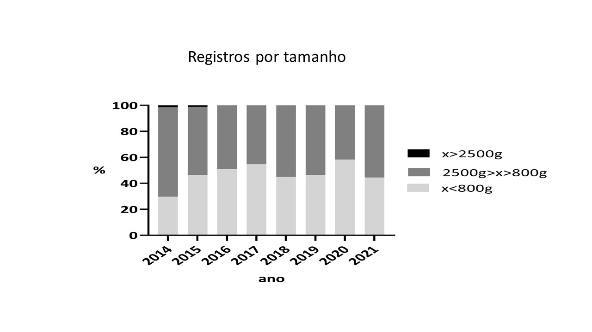

\renewcommand{\figurename}{Figura}
\renewcommand{\tablename}{Tabela}


```{r setup, include=FALSE}
knitr::opts_chunk$set(
	echo = FALSE,
	message = FALSE,
	warning = FALSE
)
```


```{r echo=FALSE, message=FALSE, warning=FALSE}

library(tidyverse)
library(lubridate)

```

## Apresentação

Este relatório apresenta resultados do Programa Monitora, Subprograma Terrestre, Componente Florestal Global, Alvo Aves, protocolo básico, na **Reserva Extrativista Cazumbá-Iracema**, para o período de 2014 a 2021. O principal objetivo é subsidiar o Encontro dos Saberes que será realizado nesta unidade em março/abril de 2022.

Trata-se de um relatório simplificado, contendo informações básicas e resultados de análises preliminares relativas ao monitoramento de aves na área. Apresenta as espécies/grupos de aves registrados, o total de registros e sua flutuação ao longo do tempo, os registros por trilhas e sua similaridade, além dos registros por família e por classes e tamanho. Tais resultados propiciam algumas reflexões iniciais sobre a situação desse grupo de animais sob monitoramento na Reserva Extrativista do Cazumbá-Iracema.  


# Esforço amostral

O protocolo básico para aves utiliza o método de transecções lineares, assim como o
de mamíferos. Dois observadores percorrem as trilhas a uma velocidade constante e registram, para cada avistamento de animais dos grupos-alvo, a espécie, o número de indivíduos e a distância perperndicular entre o primeiro indivíduo avistado e o centro da trilha. Em 8 ANOS de projeto já foram percorridos 1200 km de trilhas (Figura 1).  


```{r 01, fig.align = 'center', out.width = "55%", fig.cap="Esforço amostral para o monitoramento de aves na RESEX do Cazumbá-Iracema, 2014-2021"}

knitr::include_graphics("imagens/esforco_amostral.jpg")

```


## Espécies/grupos registrados e número total de encontros

Nove espécies/grupos de aves foram registrados no monitoramento de aves da RESEX do Cazumbá-Iracema de 2014 a 2021. Na (Figura 2) são apresentadas as espécies/grupos observados e o número total de encontros registrados ao longo do período de amostagem.  Os grupos mais observados foram: Jacus, Nambus, Jacamins, Azulonas e Urus.

```{r 02, fig.align = 'center', out.width = "55%", fig.cap="Espécies/grupos observados e o número total de encontros registrados - 2014-2021. As cores representam diferentes categorias de tamanho: aves pequenas - azul; médias - marrom; grandes - verde."}

knitr::include_graphics("imagens/tabela_total_encontros.jpg")

```


Ressalta-se que diversos fatores podem influenciar a taxa de encontros. Espécies que são caçadas, por exemplo, podem ficar mais ariscas, fugindo ao menor sinal da aproximação de pessoas. 


## Tendências populacionais

Considerando conjuntamente todas as espécies/grupos registrados, a taxa de encontros, de forma geral, pareceu estável ao longo do período amostrado, apresentando, porém, uma indicação de oscilação (aumento em 2016 seguido de ligeira queda em 2017 - Figura 3).


```{r 03, fig.align = 'center', out.width = "55%", fig.cap="Variação da taxa de encontro ao longo do tempo, considerando conjuntamente todos os grupos registrados."}

knitr::include_graphics("imagens/taxa_encontro_total.jpg")

```

Quando as espécies/grupos de aves são avalidas separadamente, as respostas em termos de flutuação dos registros ao longo do tempo são mais variáveis. Os registros para cada espécie/grupo de aves são apresentados nas Figuras 4 a 6.

```{r 04, fig.align = 'center', out.width = "55%", fig.cap="Variação nas taxas de encontro de Crypturellus spp. e Tinamus spp. ao longo do tempo."}

knitr::include_graphics("imagens/familia1.jpg")

```


```{r 05, fig.align = 'center', out.width = "55%", fig.cap="Variação nas taxas de encontro de Psophia leucoptera e Odontophorus stellatus ao longo do tempo."}

knitr::include_graphics("imagens/familia2.jpg")

```


```{r 06, fig.align = 'center', out.width = "55%", fig.cap="Variação nas taxas de encontro de Penelope jacquacu, Pauxi tuberosa, Ortalis guttata, Nothocrax urumutum e Aburria cumanensis ao longo do tempo."}

knitr::include_graphics("imagens/familia3.jpg")

```

## Diferenças/similaridades entre localidades (trilhas)

Os dados foram analisados também em relação às localidades amostradas. A trilha Gamas apresentou o maior percentual de registros (> 50%), mas apenas 5 espécies/grupos de aves foram registrados nessa localidade, enquanto nas trilhas Cazumbá e Alto Caeté foram observados 7 espécies/grupos (Figuras 7 a 10).  


```{r 07, fig.align = 'center', out.width = "55%", fig.cap="Variação nas taxas de encontro de Crypturellus spp. e Tinamus spp. ao longo do tempo."}

knitr::include_graphics("imagens/trilha_gamas.jpg")

```


```{r 08, fig.align = 'center', out.width = "55%", fig.cap="Variação nas taxas de encontro de Crypturellus spp. e Tinamus spp. ao longo do tempo."}

knitr::include_graphics("imagens/trilha_cazumba.jpg")

```


```{r 9, fig.align = 'center', out.width = "55%", fig.cap="Variação nas taxas de encontro de Crypturellus spp. e Tinamus spp. ao longo do tempo."}

knitr::include_graphics("imagens/trilha_alto_caete.jpg")

```

```{r 10, fig.align = 'center', out.width = "55%", fig.cap="As trilhas Cazumbá e Alto Caeté mostraram-se mais similares com base na riqueza e abundância de espécies/grupos registrados."}

knitr::include_graphics("imagens/similaridade_trilhas.jpg")

```

\newpage

## Análise por famílias

As famílias com mais registros foram Tinamidae e Cracidae, seguidas por Psophidae e Odontophoridae (Figura 11). Os resultados da RESEX do Cazumbá-Iracema estão alinhados aos resultados observados para outras unidades de conservação Amazônicas.


```{r 11, fig.align = 'center', out.width = "55%", fig.cap="Registros de espécies/grupos de aves na RESEX do Cazumbá-Iracema organizados por família (valores absolutos e percentual)."}

knitr::include_graphics("imagens/registros_familia.jpg")

```


## Análise por tamanho

As espécies/grupos registrados foram também separadas em três categorias de tamanho (aves Pequenas, Médias e Grandes). Foram registradas três espécies/grupos de aves pequenas, cinco de tamanho médio e uma grande (Figura 12).


```{r 12, fig.align = 'center', out.width = "65%", fig.cap="Aves monitoradas na RESEX do Cazumbá-Iracema em suas respectivas categorias de tamanho."}

knitr::include_graphics("imagens/tamanho.jpg")

```

A proporção de aves registradas em cada categoria de tamanho para o período de 2014-2021 é apresentada na Figura 13.  

```{r 13, fig.align = 'center', out.width = "85%", fig.cap="Proporção de registros de espécies/grupos de aves pequenas, médias e grandes obtidos na RESEX do Cazumbá-Iracema de 2014-2021."}



```

# Alguns pontos para análise/reflexão

Inicialmente, destaca-se que a equipe envolvida na execução do monitoramento vem realizando um excelente trabalho, tendo em vista a adequada aplicação do protocolo, com adoção dos procedimentos previstos, e o fato de não ter havido nenhuma lacuna de amostragem de 2014 a 2021. No período foram percorridos 1200 km de trilhas, com amostragens regulares em todas as três localidades, conferindo qualidade e robustez aos dados e resultados obtidos.  

Os táxons (espécies/grupos) esperados foram registrados na UC e considerando o conjunto de aves observadas, houve um pequeno aumento no número de registros em 2016, seguido de queda em 2017, ainda que a tendência geral pareça ser de estabilidade. Quais fatores poderiam explicar essa aparente variação na abundância dos grupos monitorados?

Algumas diferenças na riqueza (quantas espécies/grupos diferentes ocorrem), na abundância (a quantidade de registros de cada espécie/grupo) e na composição (quais são as espécies/grupos registradas em cada trilha) foram observadas entre as localidades. A localidade "Gamas", por exemplo, apresentou o maior número de registros, porém com uma menor riqueza e as potenciais causas para tais resultados devem ser levantadas pelo grupo de atores envolvidos no processo de monitoramento.

Por fim, destaca-se também o baixo número de registros de espécies/grupos de aves de maior porte. Esse resultado parece estar alinhado ao observado em outras unidades de conservação do estado do Acre, cabendo também uma uma reflexão sobre suas potenciais causas.


